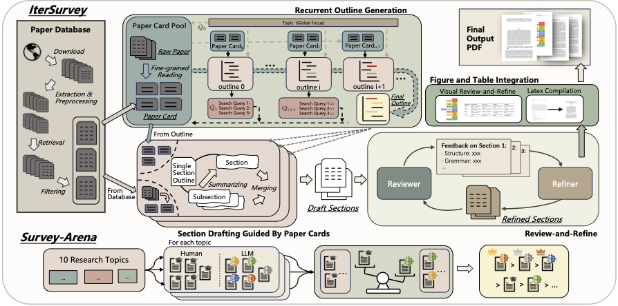

# IterSurvey (AutoSurvey v2, NeurIPS 2025)

<p align="center">
  <a href="https://arxiv.org/abs/2510.21900v1"><b>Deep Literature Survey Automation with an Iterative Workflow</b></a>
</p>
<p align="center">
  Hongbo Zhang<sup>1,2∗</sup>, Han Cui<sup>1,2∗</sup>, Yidong Wang<sup>2,3</sup>, Yijian Tian<sup>2</sup>, Qi Guo<sup>3</sup>, Cunxiang Wang<sup>2</sup>, Jian Wu<sup>2</sup>, Chiyu Song<sup>2</sup>, Yue Zhang<sup>2,4†</sup>
  <br><br>
  <sup>1</sup>Zhejiang University, <sup>2</sup>School of Engineering, Westlake University, <sup>3</sup>Peking University, <sup>4</sup>Institute of Advanced Technology, Westlake Institute for Advanced Study
</p>

---

## 🧠 Introduction

**IterSurvey** is the second-generation framework following [**AutoSurvey (NeurIPS 2024)**](https://github.com/AutoSurveys/AutoSurvey), designed to automate the process of literature survey writing in a more *human-like, iterative* manner.
Unlike one-shot generation, **IterSurvey** reads, plans, and revises through multiple rounds, refining both structure and content dynamically.

### 🔑 Core Innovations
1. **Recurrent Outline Generation** – incrementally retrieves and updates topic structure for better coverage.
2. **Paper Cards** – structured, fine-grained evidence extracted from each paper (contribution, method, finding).
3. **Review-and-Refine Loop** – a global revision mechanism ensuring coherence, factual consistency, and stylistic quality.
4. **Survey-Arena Evaluation** – a new pairwise LLM-based evaluation benchmark aligned with human judgment.

> 🏆 IterSurvey achieves superior survey quality and citation accuracy, outperforming AutoSurvey, SurveyForge, and SurveyGo.

---

## 🔍 Overview



**Figure 1.** The IterSurvey iterative workflow, including recurrent outline generation, paper card distillation, section drafting, and the reviewer–refiner loop.
This pipeline produces coherent, evidence-grounded, and citation-rich literature surveys.

---

## ⚙️ Requirements

- Python ≥ 3.10
- CUDA-capable GPU (optional but recommended)
- Dependencies listed in `requirements.txt`

---

## 📦 Installation

```bash
# Clone repository
git clone https://github.com/HancCui/IterSurvey_AutoSurveyv2.git
cd IterSurvey_AutoSurveyv2

# Install dependencies
pip install -r requirements.txt

# If you encounter langchain version conflicts, clean up old versions first:
# pip freeze | grep -i langchain | xargs pip uninstall -y
# pip install -r requirements.txt

# Prepare for the database
mkdir ./database
```

---

## 🚀 Usage

### ⚠️ Prerequisites (Important!)

Before generating surveys, please complete the following preparations. **Without these steps, the first run may take 7-8 hours** as the system needs to crawl and process papers on-the-fly.

#### 1. Download Embedding Model

Download the embedding model for semantic retrieval:

```bash
# Using Hugging Face CLI
huggingface-cli download nomic-ai/nomic-embed-text-v1.5 --local-dir ./models/nomic-embed-text-v1.5

# Or using Git LFS
git lfs install
git clone https://huggingface.co/nomic-ai/nomic-embed-text-v1.5 ./models/nomic-embed-text-v1.5
```

#### 2. Crawl Papers (Recommended)

Pre-crawling papers significantly speeds up survey generation. Use the included arxiv_crawler:

```bash
cd arxiv_crawler

# Crawl papers for a specific topic (e.g., "large language models")
python crawl.py --query "large language models" --max_results 1000 --output ../database/papers

# Or crawl by category
python crawl.py --category cs.CL --max_results 2000 --output ../database/papers
```

> **Note**: If you skip this step, IterSurvey will crawl papers during generation, which takes significantly longer.

#### 3. Start MinerU Service

MinerU is used for PDF-to-Markdown conversion. Start the service before running:

```bash
# Use the provided startup script
bash main_mineru.sh

# Or with custom port and host
bash main_mineru.sh 8000 127.0.0.1
```

The script will:
- Check if the port is occupied and terminate conflicting processes
- Start MinerU with optimized settings (local model, torch compile enabled)
- Save logs to `./logs/mineru.log`
- Automatically verify the service is running

Verify MinerU is running:
```bash
curl http://localhost:8000
```

---

### 🎨 Option A: Web Interface (Recommended)

We provide a user-friendly web interface for easy survey generation with real-time logging and PDF download.

#### Quick Start

```bash
# Install Flask (if not installed)
pip install flask

# Launch the web interface
python web_app.py
```

Then open your browser and navigate to `http://localhost:7860`

#### Features
- 📝 Easy parameter configuration with clear required/optional fields
- 📊 Real-time progress monitoring with streaming logs
- 📄 One-click PDF download when generation completes
- 🎯 Beautiful modern UI with no external CDN dependencies

---

### 💻 Option B: Command Line Interface

### 1️⃣ Generate a Survey

Example command for generating a literature survey on *“LLMs for Education”*:

```bash
python main.py \
    --topic "LLMs for Education" \
    --gpu 0 \
    --saving_path ./output/ \
    --model gpt-4o-2024-05-13 \
    --section_num 8 \
    --rag_num 60 \
    --db_path ./database \
    --embedding_model nomic-ai/nomic-embed-text-v1.5 \
    --api_url https://api.openai.com/v1/chat/completions \
    --api_key sk-xxxxxx
```

**Pipeline Steps**

1. Recurrent outline generation
2. Paper card extraction
3. Section drafting and synthesis
4. Review-and-refine integration

Results are stored in:

```
./output/{topic}/
```

---

### 2️⃣ Evaluate a Generated Survey

```bash
python evaluation.py \
    --topic "LLMs for Education" \
    --gpu 0 \
    --saving_path ./output/ \
    --model gpt-4o-2024-05-13 \
    --db_path ./database \
    --embedding_model nomic-ai/nomic-embed-text-v1.5 \
    --api_key sk-xxxxxx
```

**Supported Evaluation Modes**

* *Automatic LLM-as-a-Judge Scoring* – content, coherence, citation.
* *Survey-Arena Pairwise Ranking* – robust, model-agnostic comparison.

Evaluation results:

```
./output/{topic}/evaluation.json
```

---

## 🧩 Key Modules

| Module                 | Description                                                                  |
| ---------------------- | ---------------------------------------------------------------------------- |
| `recurrent_outline.py` | Implements Algorithm 1 for iterative outline generation and topic expansion. |
| `paper_card.py`        | Extracts structured Paper Cards (Contribution–Method–Finding triplets).      |
| `section_drafting.py`  | Drafts survey sections using outline + Paper Cards.                          |
| `review_refine.py`     | Performs the Reviewer–Refiner global revision loop.                          |
| `arena_eval.py`        | Implements Survey-Arena pairwise evaluation (GPT-4o, Claude-3.5, GLM-4.5V).  |

---

## 📚 Citation

If you use **IterSurvey (AutoSurvey v2)**, please cite:

```bibtex
@misc{zhang2025deepliteraturesurveyautomation,
      title={Deep Literature Survey Automation with an Iterative Workflow},
      author={Hongbo Zhang and Han Cui and Yidong Wang and Yijian Tian and Qi Guo and Cunxiang Wang and Jian Wu and Chiyu Song and Yue Zhang},
      year={2025},
      eprint={2510.21900},
      archivePrefix={arXiv},
      primaryClass={cs.CL},
      url={https://arxiv.org/abs/2510.21900},
}
```

and the original AutoSurvey:

```bibtex
@article{wang2024autosurvey,
  title={AutoSurvey: Large Language Models Can Automatically Write Surveys},
  author={Wang, Yidong and Guo, Qi and Yao, Wenjin and Zhang, Hongbo and Zhang, Xin and Wu, Zhen and Zhang, Meishan and Dai, Xinyu and Zhang, Min and Wen, Qingsong and others},
  journal={arXiv preprint arXiv:2406.10252},
  year={2024}
}

@inproceedings{
2024autosurvey,
title={AutoSurvey: Large Language Models Can Automatically Write Surveys},
author = {Wang, Yidong and Guo, Qi and Yao, Wenjin and Zhang, Hongbo and Zhang, Xin and Wu, Zhen and Zhang, Meishan and Dai, Xinyu and Zhang, Min and Wen, Qingsong and Ye, Wei and Zhang, Shikun and Zhang, Yue},
booktitle={The Thirty-eighth Annual Conference on Neural Information Processing Systems},
year={2024}
}
```

---

## 🙏 Acknowledgements

Our work builds upon several open-source datasets and models.
We sincerely thank the following projects and communities for their contributions:

* **arXiv (CS subset)** — The core retrieval corpus used in this work (~680 K papers).
* **MinerU (Wang et al., 2024)** — For reliable PDF-to-Markdown parsing and figure/table extraction.
* **nomic-ai / nomic-embed-text-v1.5** — Employed as the embedding model for semantic retrieval.
* **Large Language Models** — GPT-4o (and GPT-4o-mini) for generation and refinement; Claude-3.5-Haiku and GLM-4.5V as independent evaluators in Survey-Arena.
* We also thank the open-source ecosystem supporting scientific NLP research and the institutions providing computational resources for large-scale evaluation.

> Without these open contributions, **IterSurvey (AutoSurvey v2)** would not have been possible.

---

## 🪪 License

This project is released under the **MIT License**.
Generated surveys are intended for **academic research only** and should not be treated as authoritative scientific reviews.
